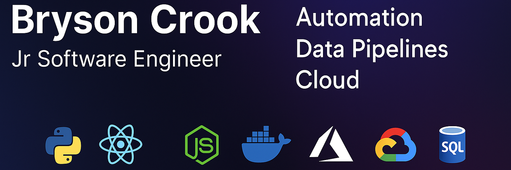

  
  &nbsp;
  

**Software Engineer @ Drewlo Holdings** · B.Eng. Software Engineering, Western University (2025)

I build **automation systems, internal tools, and data platforms** for property management and construction. Most of my work ships to private repos — this profile highlights what I'm building.

---

## Tech Stack

  
  
  
  
  
  
  
  
  
  
  
  

---

## Featured Projects

### AI Tool Suite for Open WebUI
Nine purpose-built tools integrated into our local AI stack: **CMHC** housing data, **Statistics Canada** datasets, **Bank of Canada** rates, **CanLII** legal search, **London Open Data** municipal records, **Google Maps** geocoding & places, **Weather** forecasts, **YouTube Transcript** extraction, and a **Document Generator** for formatted reports.

### Data Dashboards & Reporting
**jonas-truckast-dashboard** — Real-time fleet & dispatch visibility built on Jonas Construction data.
**cost-allocation-reporter** — Automated cost allocation breakdowns for property management accounting.

### Microservice Platform
Seven+ FastAPI microservices powering internal operations: **MS Graph** integration, **SearXNG** meta-search, **Sora** media generation, **web scraping** pipelines, **IT ticket** management, and more. Containerized with Docker, deployed on Azure.

### Web Scrapers
Automated data collection from **Facebook Marketplace**, **HiBid** auctions, and **Truckast** logistics — structured extraction with scheduling, deduplication, and alerting.

### Full-Stack Applications
**Drewlo Apartment Finder** — Tenant-facing apartment search with filtering, maps, and availability sync.
**AI Email Sorter** — Intelligent inbox triage using LLM classification and rule-based routing.

### Workflow Automation
**n8n email organizer** — Multi-step email processing pipeline with AI categorization and auto-filing.
**AI site manager** — Automated construction site reporting and task coordination.

---

## Contact

📧 [bcrook@drewloholdings.com](mailto:bcrook@drewloholdings.com)
